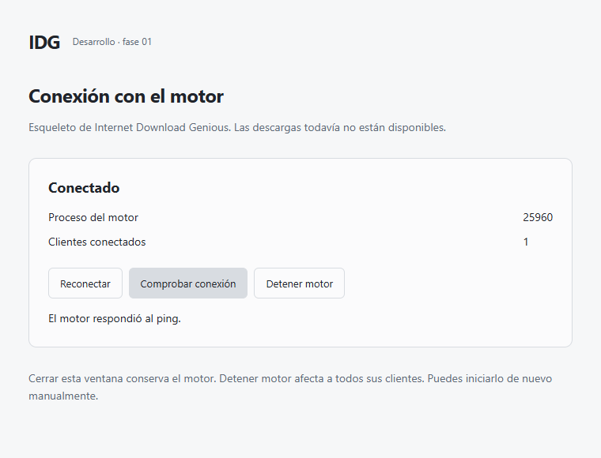

# IDG — Internet Download Genious

Un proyecto de gestor de descargas **gratuito y open source para Windows 10 y Windows 11**, pensado para descargar y organizar archivos con una interfaz sencilla y moderna.

> **Estado actual: esqueleto de desarrollo (fase 01).** La ventana y las extensiones de prueba se conectan al motor local en Windows 11. Todavía no descarga archivos y no hay instalador, versión publicada ni extensión en tiendas.

## ¿Qué es IDG?

IDG busca ser una alternativa moderna a los gestores de descargas tradicionales. La idea es que puedas pulsar un enlace en el navegador, revisar dónde guardar el archivo y ver el progreso sin tener que configurar conexiones ni entender detalles técnicos.

El objetivo es aprovechar la velocidad disponible, recuperar descargas cuando sea posible y mantener un consumo moderado. **No se promete una velocidad superior a otros programas ni reanudación garantizada en todos los servidores.**

## ¿Puedo instalarlo ahora?

**Aún no. No hay un instalador disponible.** Windows 10/11 x64 es el objetivo inicial; el esqueleto se probó en Windows 11 x64. Windows 10 está pendiente.

Cuando haya una versión publicada y verificada, esta sección incluirá el enlace real al instalador, los requisitos comprobados y las instrucciones para instalar la extensión. Hasta entonces, descargar este repositorio solo proporciona documentación y código fuente para desarrollo.

Consulta la [guía de instalación y estado de las versiones](docs/INSTALACION.md). No necesitas aprender a compilar para usar una futura versión instalable; las instrucciones de desarrollo estarán separadas.

## ¿Cómo probar la conexión hoy?

Solo para desarrollo: sigue la [guía de compilación y carga local](docs/DESARROLLO.md). Con el motor iniciado, abre la ventana o el popup de la extensión: mostrará **Conectado**. **Reconectar** vuelve a comprobar el enlace. Cerrar el popup o la ventana conserva el motor; **Detener motor** lo cierra. La extensión no captura descargas ni solicita acceso a tus páginas. Esta carga local no es una instalación final para usuarios.

## ¿Cómo se plantea usarlo?

Este es el flujo previsto, no una afirmación de que ya esté disponible:

1. Instalar IDG y elegir la carpeta de descargas en un asistente breve.
2. Instalar la extensión del navegador y elegir si IDG debe capturar las descargas, preguntar o dejarlas al navegador.
3. Pulsar un enlace, revisar el nombre y la carpeta, y elegir **Descargar ahora**.
4. Ver velocidad y progreso, pausar cuando corresponda y abrir la carpeta al terminar.

## Funciones previstas

| Área | Qué se pretende ofrecer | Estado del kit |
|---|---|---|
| Descargas | HTTP/HTTPS, segmentación adaptable, recuperación, límites, colas y horarios; FTP en una fase posterior | Planificado |
| Interfaz | Sidebar, temas suaves claro/oscuro/sistema, búsqueda, filtros, acciones masivas y gráficas dentro de las filas | Interfaz completa planificada; ventana de conexión comprobada |
| Navegadores | Extensión para Chrome, Edge, Firefox y otros navegadores contemplados en la matriz de pruebas; sin Safari | Puente real probado en Chrome for Testing y Firefox; captura pendiente |
| Multimedia | Detección de contenido compatible sin DRM, selección de calidad, audio y procesamiento con FFmpeg | Planificado |
| Organización y privacidad | Carpetas y reglas, historial, modo privado y funcionamiento local sin cuenta obligatoria | Planificado |
| Distribución | Instalador Windows y actualizaciones verificadas desde GitHub Releases, aceptadas por el usuario | Planificado |

BitTorrent y sincronización entre equipos son ampliaciones opcionales, no requisitos de la primera versión. La compatibilidad definitiva se publicará solo después de probarla.

## ¿Cómo se verá?

Una herramienta de escritorio sobria, inspirada en la claridad visual de Vercel: fondos suaves, bordes discretos y la lista de descargas como elemento principal. No un panel lleno de tarjetas decorativas.

La [especificación de interfaz](docs/INTERFAZ.md) explica cada pantalla y su comportamiento. El [sistema visual](docs/DESIGN_SYSTEM.md) define colores, tamaños y componentes. La ventana actual solo comprueba la conexión; todavía no representa la interfaz completa especificada.

## Privacidad y seguridad previstas

El diseño base funciona localmente y sin cuenta obligatoria. No contempla telemetría activa por defecto, ejecución automática de los archivos descargados ni evasión de DRM. Los límites de los servidores, de la sesión del navegador y de Windows deben comunicarse sin ocultarlos.

Estas son decisiones de diseño, no una certificación de seguridad de una aplicación ya construida.

## Desarrollo y colaboración

El repositorio público es [SrEdgarR/IDG](https://github.com/SrEdgarR/IDG). Consulta la [guía de contribución](CONTRIBUTING.md) para proponer mejoras.

Para empezar el desarrollo, lee [LEEME_PRIMERO.md](LEEME_PRIMERO.md) y el [primer mensaje para Astra](PRIMER_MENSAJE_ASTRA.md). El código se construirá por fases, con controles de versión y pruebas. Los pasos reproducibles de compilación y prueba están en la [guía para desarrolladores](docs/DESARROLLO.md), sin mezclarse con la instalación para usuarios.

Las decisiones técnicas son Rust para motor/runtime, Tauri con React/TypeScript para escritorio y WebExtensions para el navegador. El [estado de implementación](docs/IMPLEMENTATION_STATUS.md) diferencia trabajo planificado, implementado y realmente verificado.

## Ayuda y documentación

Consulta el [índice de documentación](docs/README.md), la [guía de instalación](docs/INSTALACION.md) y el [alcance del producto](docs/PRODUCT_SPEC.md). Puedes reportar problemas de documentación en [Issues](https://github.com/SrEdgarR/IDG/issues). Para posibles vulnerabilidades, consulta [SECURITY.md](SECURITY.md). No incluyas contraseñas, cookies, enlaces privados ni datos personales en reportes públicos.

## Licencia

El proyecto se distribuye bajo **GPL-3.0-only**, únicamente la versión 3; consulta el [texto completo](LICENSE) y los [avisos de terceros](THIRD_PARTY_NOTICES.md). No se presentan los prompts como una implementación terminada del programa.

Captura de la prueba real en Windows 11. Solo conexión; todavía no hay descargas.
