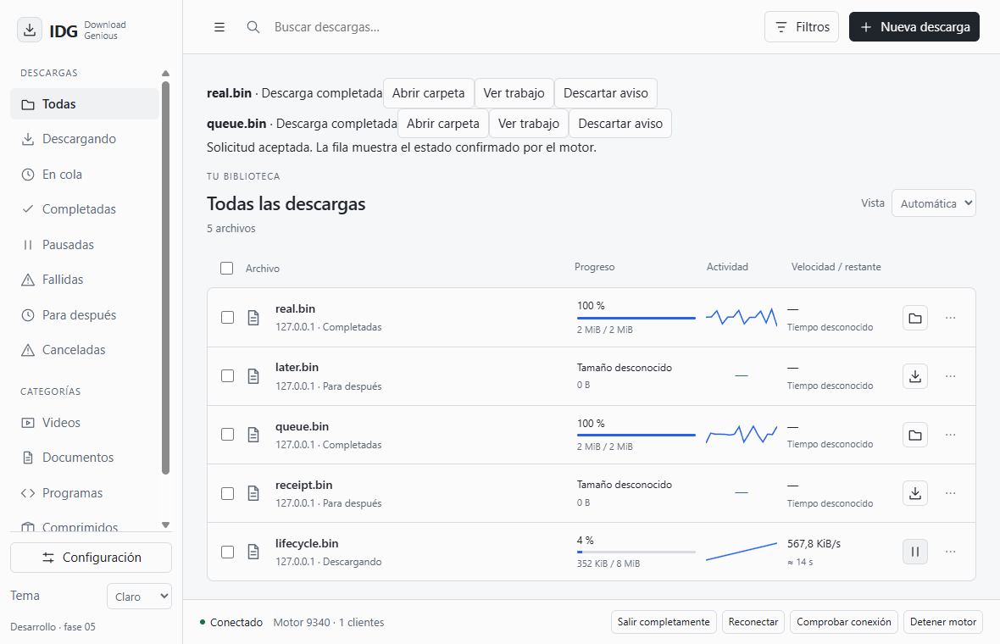
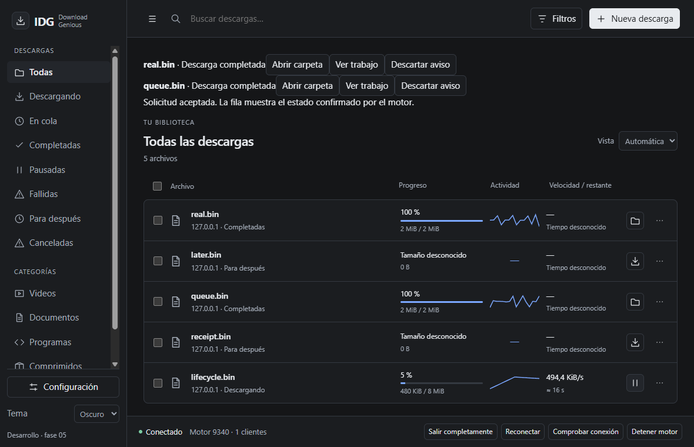
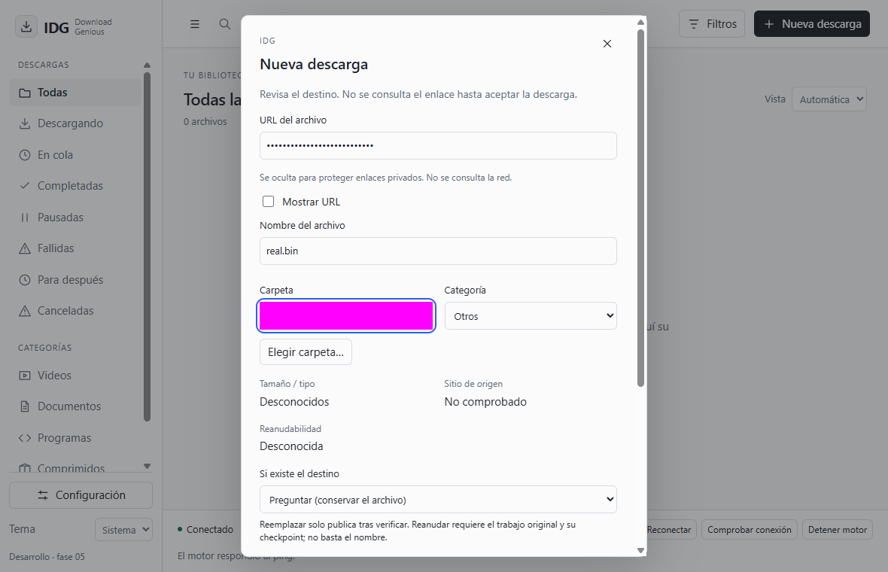

# IDG — Internet Download Genious

Un proyecto de gestor de descargas **gratuito y open source para Windows 10 y Windows 11**, pensado para descargar y organizar archivos con una interfaz sencilla y moderna.

> **Estado actual: aplicación de desarrollo (fase 12, EN_CURSO).** En Windows 11, el historial detectó un archivo movido y volvió a asociarlo tras comprobar su tamaño y hash en un recorrido automatizado de Tauri; el selector nativo para elegir el archivo sigue pendiente de prueba interactiva. El modo privado mantiene sus metadatos solo mientras vive el runtime: tras reiniciarlo no se puede recuperar ese trabajo, y el archivo guardado permanece en el disco. La exportación de diagnóstico redactada está conectada a Ajustes y compilada; falta probar el diálogo nativo de guardado. Persisten los límites de FTP/FTPS y proxy descritos en la [matriz de capacidades](docs/PROTOCOL_SUPPORT.md), Firefox **Aceptar PENDIENTE**, AutoPick requerido con captura automática deshabilitada y sesiones autenticadas no transferidas. No hay instalador, versión publicada ni extensión en tiendas.

## ¿Qué es IDG?

IDG busca ser una alternativa moderna a los gestores de descargas tradicionales. La idea es que puedas pulsar un enlace en el navegador, revisar dónde guardar el archivo y ver el progreso sin tener que configurar conexiones ni entender detalles técnicos.

El objetivo es aprovechar la velocidad disponible, recuperar descargas cuando sea posible y mantener un consumo moderado. **No se promete una velocidad superior a otros programas ni reanudación garantizada en todos los servidores.**

## ¿Puedo instalarlo ahora?

**Aún no. No hay un instalador disponible.** Windows 10/11 x64 es el objetivo inicial; el esqueleto se probó en Windows 11 x64. Windows 10 está pendiente.

Cuando haya una versión publicada y verificada, esta sección incluirá el enlace real al instalador, los requisitos comprobados y las instrucciones para instalar la extensión. Hasta entonces, descargar este repositorio solo proporciona documentación y código fuente para desarrollo.

Consulta la [guía de instalación y estado de las versiones](docs/INSTALACION.md). No necesitas aprender a compilar para usar una futura versión instalable; las instrucciones de desarrollo estarán separadas.

## ¿Cómo probar la conexión hoy?

Solo para desarrollo: sigue la [guía de compilación y carga local](docs/DESARROLLO.md). Abrir IDG inicia su motor validado; el popup muestra **Conectado** solo tras un intercambio real. **Reconectar** comprueba el enlace. X oculta la ventana y conserva las descargas; **Salir completamente** confirma y guarda el estado antes de detenerlo. Los enlaces HTTP/HTTPS/FTP que se introducen en la app se deben revisar y confirmar. FTP avisa que transmite datos sin cifrar y exige consentimiento; FTPS no tiene aún un recorrido E2E completo desde la interfaz. La captura automática está deshabilitada y AutoPick sigue siendo un requisito pendiente. Las sesiones autenticadas del navegador no se transfieren. En Firefox, **Aceptar sigue PENDIENTE**: el diálogo de nueva descarga permaneció abierto y no se verificó archivo/hash. Los permisos y gestos del manifiesto normal siguen pendientes. Esta carga local no es una instalación final para usuarios.

El [recorrido de organización de fase 06](docs/FASE06_PRUEBA_MANUAL.md) explica cómo importar enlaces, usar dos colas, programar un inicio y revisar reglas. Al guardar un horario, el editor distingue la fecha aún sin guardar de la programación confirmada por el motor. Los horarios necesitan el motor activo y Windows despierto. Estadísticas y monitor del portapapeles están apagados por defecto; este último propone enlaces, nunca descarga silenciosamente. Quitar del historial conserva el archivo. Eliminarlo del disco requiere otra confirmación y no permite deshacer. Las pruebas de energía usan simulación, sin apagar ni suspender el equipo.

## ¿Cómo se plantea usarlo?

Este es el flujo previsto, no una afirmación de que ya esté disponible:

1. Instalar IDG y elegir la carpeta de descargas en un asistente breve.
2. Instalar la extensión del navegador y elegir si IDG debe capturar las descargas, preguntar o dejarlas al navegador.
3. Pulsar un enlace, revisar el nombre y la carpeta, y elegir **Descargar ahora**.
4. Ver velocidad y progreso, pausar cuando corresponda y abrir la carpeta al terminar.

## Funciones previstas

| Área | Qué se pretende ofrecer | Estado del kit |
|---|---|---|
| Descargas | HTTP/HTTPS, segmentación adaptable, recuperación, límites, colas y horarios; FTP/FTPS y proxies en fase 11 | HTTP/HTTPS probado localmente. FTP plano se completó desde Tauri con credenciales ficticias y hash; FTPS está probado en el core, no de punta a punta en Tauri. HTTP/SOCKS usa proxies locales en pruebas; proxy de Windows y efecto del ajuste de interfaz pendientes. FTP/FTPS no soportan proxy. Autenticación manual no comparte sesiones del navegador. Ver [matriz por protocolo](docs/PROTOCOL_SUPPORT.md) |
| Interfaz | Sidebar, temas suaves claro/oscuro/sistema, búsqueda, filtros, acciones masivas y gráficas dentro de las filas | Búsqueda en el motor, acciones masivas con resultados parciales y preferencias persistentes; galería separada |
| Navegadores | Extensión prevista para Chrome, Edge y Firefox; sin Safari | Chromium: traspaso explícito de enlace público probado con fixture local en fase 07; captura automática deshabilitada. Firefox: build, manifiesto y pruebas unitarias aprobadas; **Aceptar PENDIENTE**, sin archivo/hash. Permisos/gestos normales y Edge pendientes |
| Multimedia | Detección permitida, selección explícita y procesamiento del subconjunto documentado | HLS VOD sin cifrar y DASH estático tienen pruebas locales con Tauri, archivos y hashes; E2E navegador→archivo/hash y compatibilidad ampliada pendientes |
| Organización y privacidad | Carpetas y reglas, historial, modo privado y funcionamiento local sin cuenta obligatoria | Retención e historial reversible; presencia de archivo, localización comprobada por hash, metadatos privados solo en sesión y limpieza explícita de registros terminados. La exportación redactada está implementada, con diálogo nativo pendiente de prueba. No es borrado forense. |
| Distribución | Instalador Windows y actualizaciones verificadas desde GitHub Releases, aceptadas por el usuario | Planificado |

BitTorrent y sincronización entre equipos son ampliaciones opcionales, no requisitos de la primera versión. La compatibilidad definitiva se publicará solo después de probarla.

## ¿Cómo se verá?

Una herramienta de escritorio sobria, inspirada en la claridad visual de Vercel: fondos suaves, bordes discretos y la lista de descargas como elemento principal. No un panel lleno de tarjetas decorativas.

La [especificación de interfaz](docs/INTERFAZ.md) explica cada pantalla y su comportamiento. El [sistema visual](docs/DESIGN_SYSTEM.md) define colores, tamaños y componentes. La ventana conecta con trabajos reales; las funciones posteriores permanecen identificadas como pendientes.

## Privacidad y seguridad previstas

El diseño base funciona localmente y sin cuenta obligatoria. No contempla telemetría activa por defecto, ejecución automática de los archivos descargados ni evasión de DRM. Los límites de los servidores, de la sesión del navegador y de Windows deben comunicarse sin ocultarlos.

El modo privado no oculta el archivo descargado ni garantiza que Windows o el almacenamiento no conserven rastros. Los diagnósticos no contienen nombres, rutas, URLs, historial, estadísticas ni credenciales y no se envían a ningún servicio. IDG no escribe logs persistentes; por eso no hay un archivo de log que rotar. La limpieza del historial elimina registros terminados y recibos, no archivos del disco. La información de firma/procedencia no garantiza que un archivo sea seguro.

## Desarrollo y colaboración

El repositorio público es [SrEdgarR/IDG](https://github.com/SrEdgarR/IDG). Consulta la [guía de contribución](CONTRIBUTING.md) para proponer mejoras.

Para empezar el desarrollo, lee [LEEME_PRIMERO.md](LEEME_PRIMERO.md) y el [primer mensaje para Astra](PRIMER_MENSAJE_ASTRA.md). El código se construirá por fases, con controles de versión y pruebas. Los pasos reproducibles de compilación y prueba están en la [guía para desarrolladores](docs/DESARROLLO.md), sin mezclarse con la instalación para usuarios.

Las decisiones técnicas son Rust para motor/runtime, Tauri con React/TypeScript para escritorio y WebExtensions para el navegador. El [estado de implementación](docs/IMPLEMENTATION_STATUS.md) diferencia trabajo planificado, implementado y realmente verificado.

## Ayuda y documentación

Consulta el [índice de documentación](docs/README.md), la [guía de instalación](docs/INSTALACION.md) y el [alcance del producto](docs/PRODUCT_SPEC.md). Puedes reportar problemas de documentación en [Issues](https://github.com/SrEdgarR/IDG/issues). Para posibles vulnerabilidades, consulta [SECURITY.md](SECURITY.md). No incluyas contraseñas, cookies, enlaces privados ni datos personales en reportes públicos.

## Licencia

El proyecto se distribuye bajo **GPL-3.0-only**, únicamente la versión 3; consulta el [texto completo](LICENSE) y los [avisos de terceros](THIRD_PARTY_NOTICES.md). No se presentan los prompts como una implementación terminada del programa.

Capturas auténticas conservadas de fase 05: Tauri en Windows 11 descargando archivos locales controlados. La **galería de desarrollo separada** conserva sus muestras identificadas; no aparecen en el historial real ni en el build de producción.

Para desarrolladores: [recorrido del archivo de prueba](docs/HTTP_DEVELOPMENT.md), con inicio, pausa, reanudación y comprobación de SHA-256. Es una prueba del motor, no una aplicación final para usuarios.

También está disponible la [prueba de segmentación y límites](docs/SEGMENTATION_DEVELOPMENT.md). Más solicitudes no garantizan mayor velocidad: las mediciones se limitan a servidores locales controlados.

La preferencia guardada de AutoPick no activa captura: AutoPick sigue siendo requisito y la captura automática está deshabilitada. Las descargas que inicia el navegador permanecen allí; IDG recibe enlaces elegidos y confirmados explícitamente. La limitación documentada de `DownloadItem` (no expone método ni cuerpo) se refiere a ese mecanismo y no demuestra que toda vía futura de captura sea imposible. Mini ventana y zona flotante son opcionales. Los avisos internos ofrecen acciones; la presentación de notificaciones Windows depende de sus políticas. El propietario confirmó el recorrido general de fase 05; la prueba manual de cancelación de energía simulada de fase 06 sigue bloqueada/pendiente. Consulta el [estado de implementación](docs/IMPLEMENTATION_STATUS.md) para distinguir esa confirmación de las pruebas automatizadas y sus límites.
